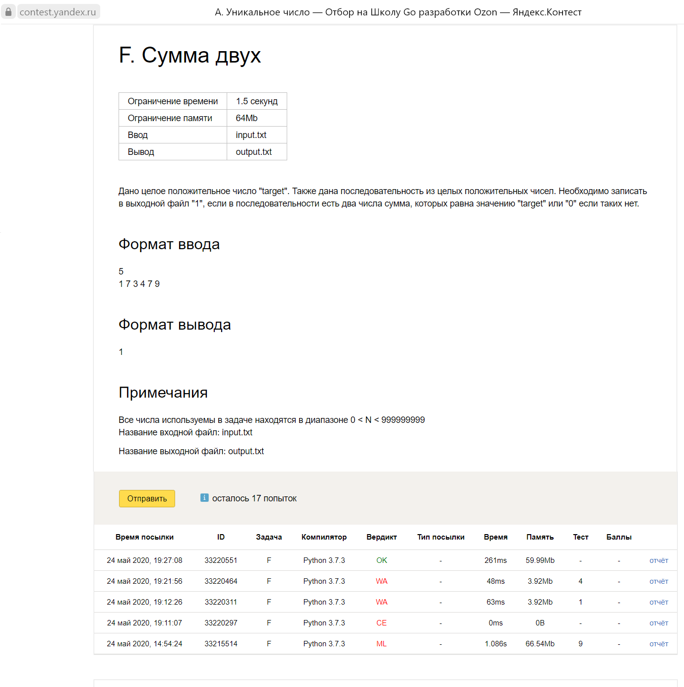
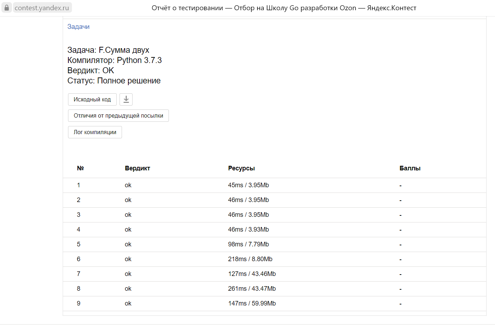
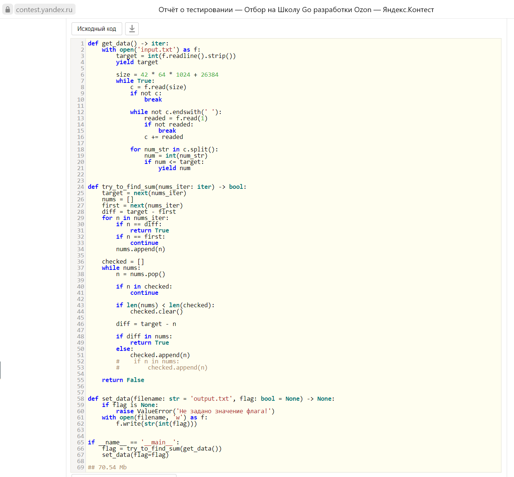
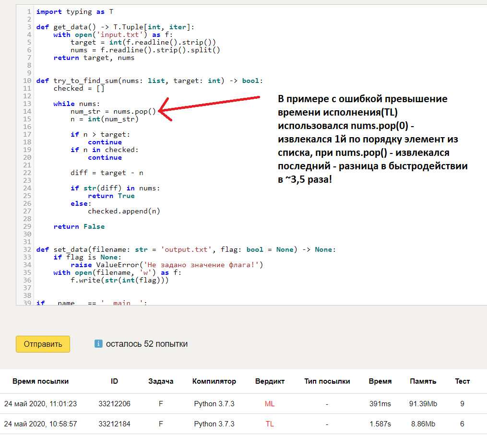

# ozon_go_school_competition
Решение на python задачи от Ozon Golang School

Задача:
Дано целое положительное число "target". Также дана последовательность из целых положительных чисел.
Необходимо записать в выходной файл "1", если в последовательности есть два числа, сумма которых равна значению "target" или "0" если таких нет

Ограничения:
| Время выполнения | 1.5 сек |
| Память | 64Мб |
| Ввод | input.txt |
| Вывод | output.txt |

Формат ввода: 
5 
1 7 3 4 7 9

Формат вывода:
1

Примечания:
Все числа используемые в задаче находятся в диапазоне 0 < N < 999999999

Вердикт проверки тестов

python-код решения

Хинт по быстродействию pop

